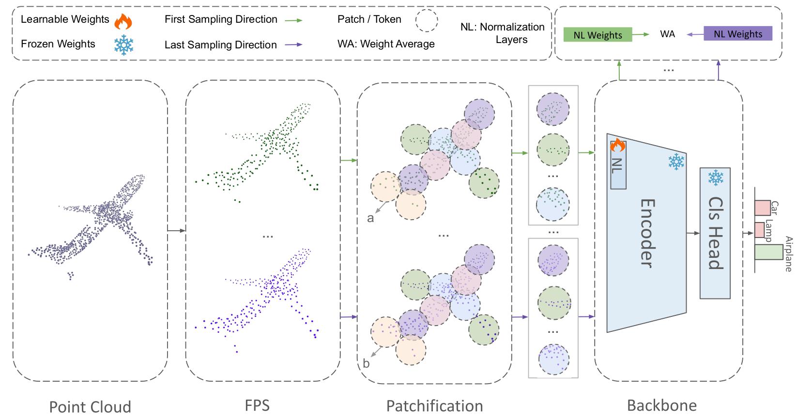

# Test-Time Adaptation in Point Clouds: Leveraging Sampling Variation with Weight Averaging



Test-Time Adaptation (TTA) addresses distribution shifts during testing by adapting a pretrained model without access to source data. In this work, we propose a novel
TTA approach for 3D point cloud classification, combining sampling variation with weight averaging. Our method leverages Farthest Point Sampling (FPS) and K-Nearest
Neighbors (KNN) to create multiple point cloud representations, adapting the model for each variation using the TENT algorithm. The final model parameters are obtained
by averaging the adapted weights, leading to improved robustness against distribution shifts. Extensive experiments on ModelNet40-C, ShapeNet-C, and ScanObjectNNC datasets, with different backbones (Point-MAE, PointNet, DGCNN), demonstrate that our approach consistently outperforms existing methods while maintaining minimal resource overhead. The proposed method effectively enhances model generalization and stability in challenging real-world conditions.


## Requirements
```
PyTorch >= 1.7.0 < 1.11.0  
python >= 3.7  
Pytorch3d
CUDA >= 9.0  
GCC >= 4.9  
```
To install all additional requirements (open command line and run):
```
pip install -r requirements.txt

cd ./extensions/chamfer_dist
python setup.py install --user

cd ..

cd ./extensions/emd
python setup.py install --user
pip install "git+https://github.com/erikwijmans/Pointnet2_PyTorch.git#egg=pointnet2_ops&subdirectory=pointnet2_ops_lib"
```

## Data Preparation
Our code currently supports three different datasets: [ModelNet40](https://arxiv.org/abs/1406.5670), [ShapeNetCore](https://arxiv.org/abs/1512.03012) and [ScanObjectNN](https://arxiv.org/abs/1908.04616).
  
### Download
To use these datasets with our code, first download them from the following sources:  
- [ModelNet](https://shapenet.cs.stanford.edu/media/modelnet40_normal_resampled.zip) 

- [ShapeNetCore](https://cloud.tsinghua.edu.cn/f/06a3c383dc474179b97d/)

- [ScanObjectNN](https://hkust-vgd.ust.hk/scanobjectnn/h5_files.zip) (It is necessary to first agree to the terms of use [here](https://forms.gle/g29a6qSgjatjb1vZ6))  

Then, extract all of these folders into the same directory for easier use.

### Adding corruptions to the data
Please refer to [MATE](https://github.com/jmiemirza/MATE) GitHub. 


## Pretraining

dataset_name : modelnet, shapenetcore, scanobject_nbg

For selection of backbone, Please refer to <dataset_name>.yaml file and change the Nmae of model.
```
CUDA_VISIBLE_DEVICES=0 python train.py --only_cls --config cfgs/pre_train/pretrain_<dataset_name>.yaml --dataset <dataset_name>
```

## Test-Time-Adaptation (TTA)
### Setting data paths 
For TTT, go to `cfgs/tta/tta_<dataset_name>.yaml` and set the `tta_dataset_path` variable to the relative path of the dataset parent directory.  
E.g. if your data for ModelNet-C is in `./data/tta_datasets/modelnet-c`, set the variable to `./data/tta_datasets`.  

Prallel Mode: Please refer to <dataset_name>.yaml file and set reset_2=True

Sequential Mode: Please refer to <dataset_name>.yaml file and set reset_2=False
```
CUDA_VISIBLE_DEVICES=0 python ttt.py --dataset_name <dataset_name> --online --config cfgs/tta/tta_<dataset_name>.yaml --ckpts <path/to/pretrained/model>
```

## Inference

For a basic inference baseline without adaptation, use
```
CUDA_VISIBLE_DEVICES=0 python test.py --dataset_name <dataset_name> --config cfgs/pre_train/pretrain_<dataset_name>.yaml  --ckpts <path/to/pretrained/model> --test_source
```

## Acknowledgements
Our codes are built upon [MATE](https://github.com/jmiemirza/MATE). We thank the authors for releasing their codes.
